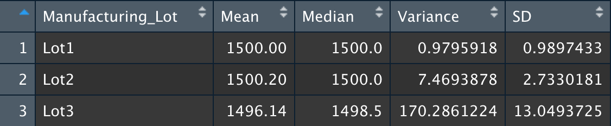
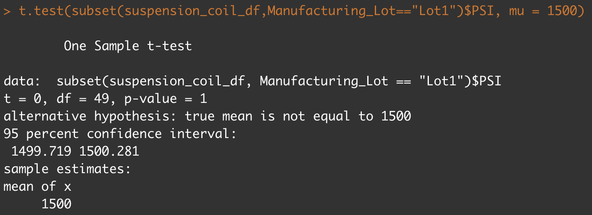
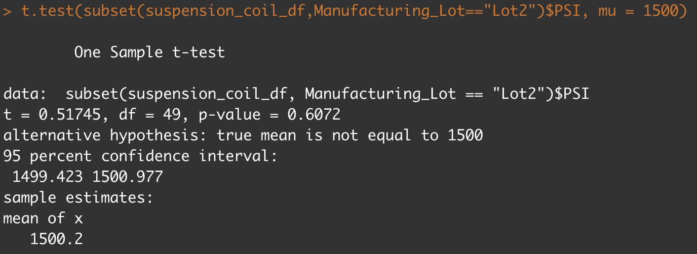

# MechaCar_Statistical_Analysis

### Deliverable 1 Summary

- As seens in the above chart the most significant variables in our data set were Vehicle Length and Width, as well as Ground clearance. Also shown is that the intercept is 
significant, which could be that there are other factors that have a strong impact on MPG.
- The slope is not zero, shown as the p-value on the chart above. This means that the relationship between our variables and the miles per gallon is subject to more than random 
chance.
- Although there are still unconsidered factors, the charts shown that the r-squared value is .71, which shows the models is alteast 71% accurate, this could be better. 

### Deliverable 2 Summary

-The overall variance is under 100 psi and meets the specifications, but Lot 3 does not meet the specifications within itself at 170.28. 

### Deliverable 3 Summary

-This first test shows that Lot 1 is not different from the total population mean, and the p-values shows we should reject the null hypothesis. 

-Similar to Lot 1, this test shows Lot 2 is not different from the total population mean, and the p-values shows we should reject the null hypothesis. 

- Looking at these results, Lot 3 is slightly statisically different from the total population mean, but the p-value is just low enough to reject the null hypothesis. 

### Deliverable 4
## Study Design: MechaCar vs Competition 

- In terms of shopping for cars there are many things people look for. Recently, I had a purchase a new car and the primary factors I was looking for were size of car, fuel 
efficency, cost, maintenance cost, and comparablity to electric. I would take a look size as this became the determine factor for me when deciding between an SUV or a sedan. 
-The metric to test would be inside space of the car, and to show how much specifially is storage space. This could be measures in cubic feet or inches. This could also easily 
be compared to other competitors.
- The null hypothesis is that there is statistically simlar space in the car. 
- The alternate hypothesis is that MechaCar's has statically more or less space than that of the competitor. 
- The simple test to be performed is average indoor space of the car against the competitor and average storage space vs the competitor. which could be done using a couple t-
test. 
